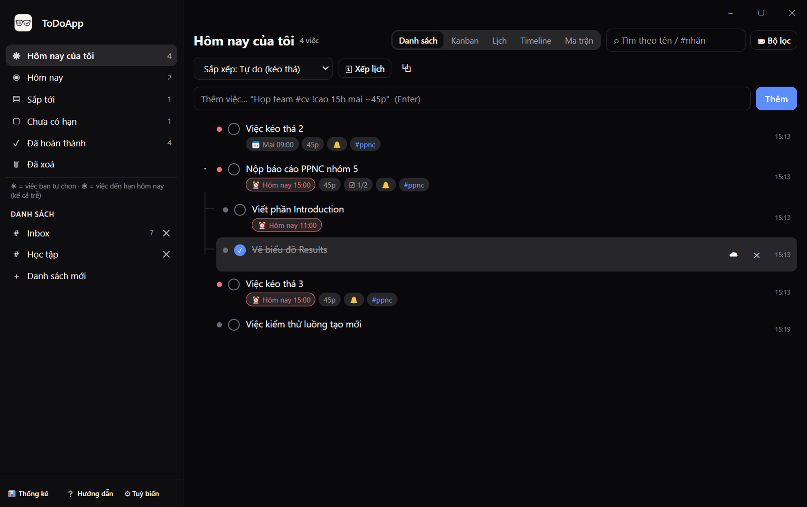
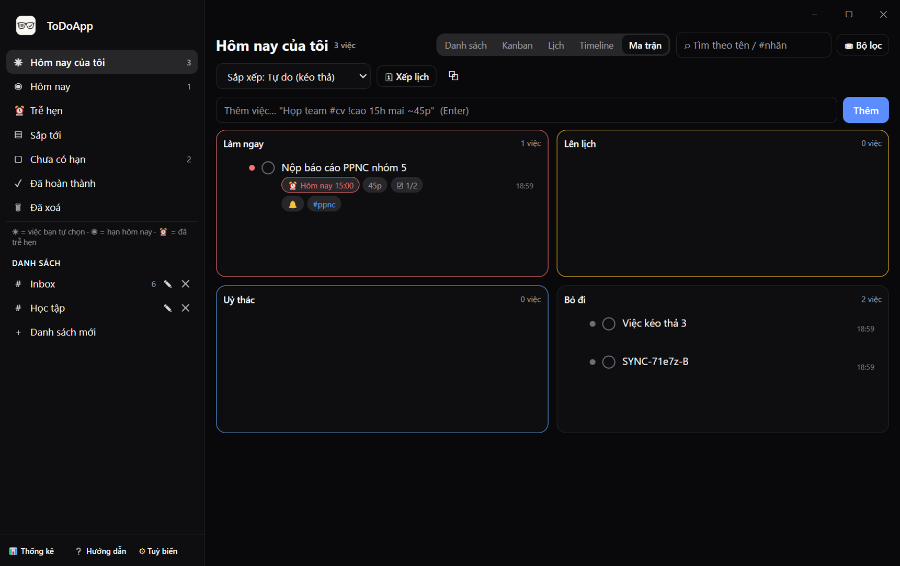
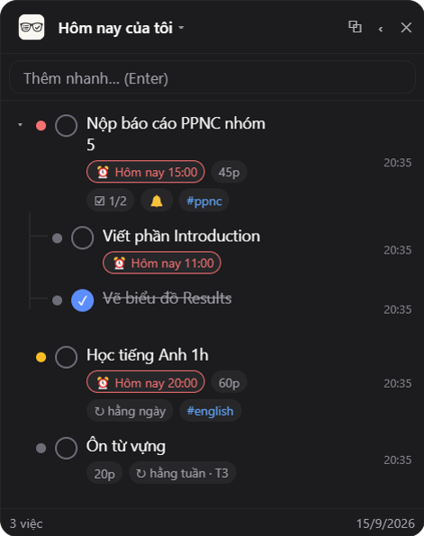
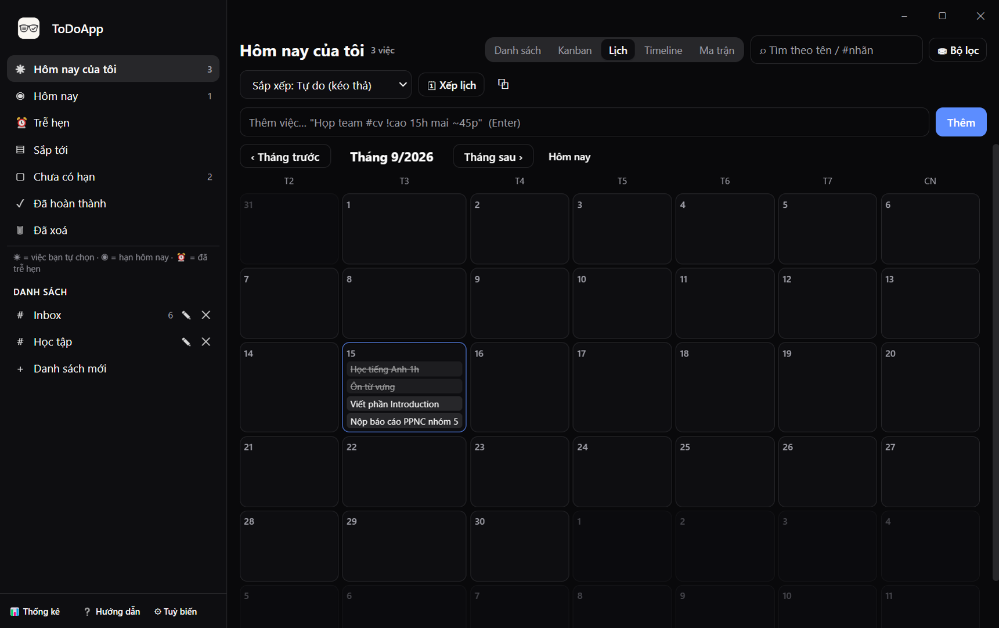
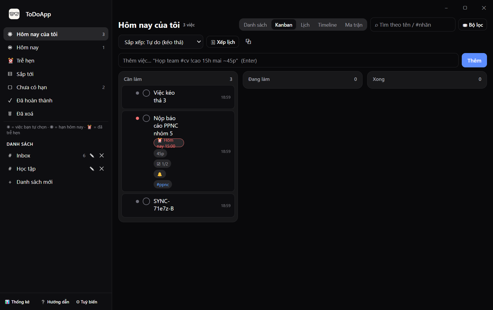
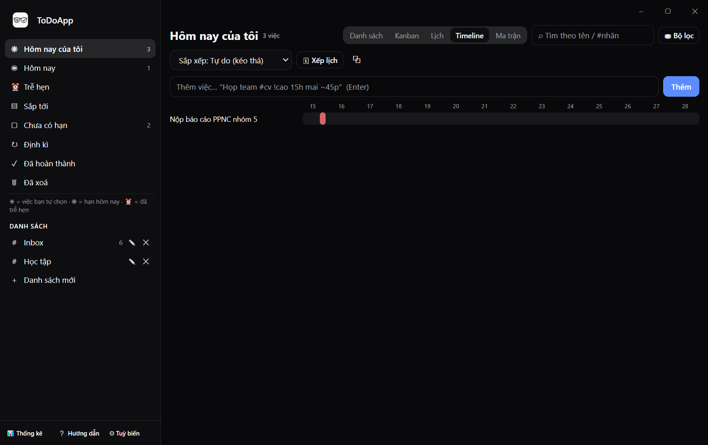
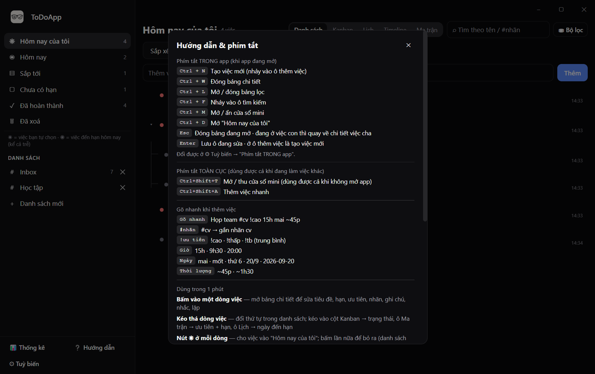
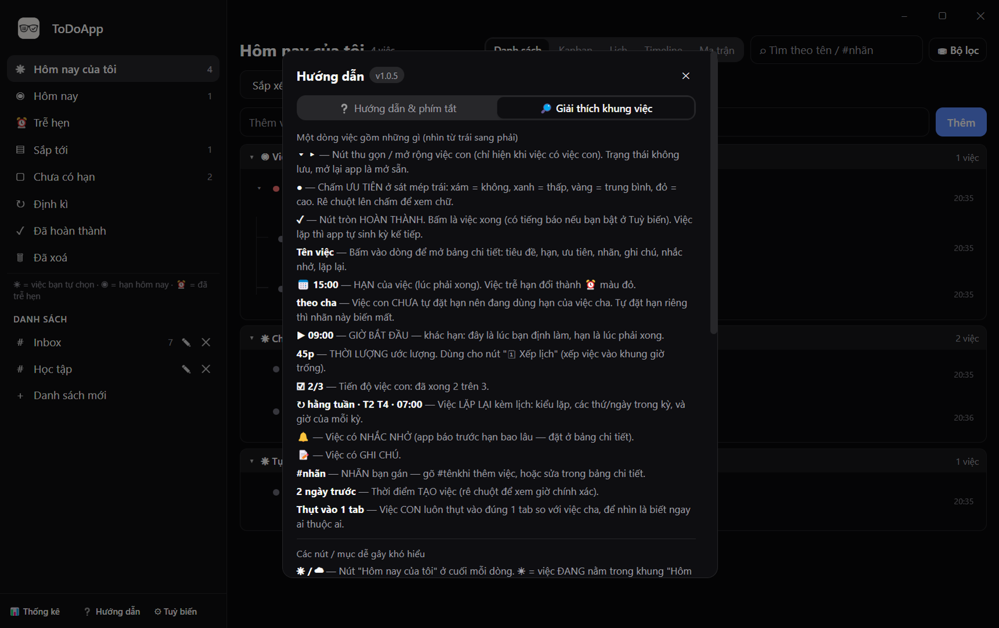
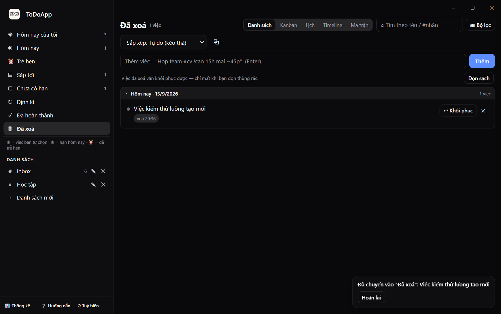

# ToDoApp

**Ứng dụng quản lý công việc cho desktop Windows** — chạy nền, có cửa sổ mini neo ở mép màn hình, luôn sẵn sàng mà không chiếm chỗ làm việc.

`v1.0.5` · Electron · dữ liệu lưu trên máy bạn

> Gõ một dòng là xong việc: `Họp team #cv !cao 15h mai ~45p`



---

## Giới thiệu

ToDoApp là app quản lý việc cá nhân, lấy cảm hứng từ TickTick, Todoist, Things 3 và Microsoft To Do — nhưng gọn hơn, chạy hoàn toàn trên máy bạn, **không cần tài khoản, không cần internet**.

Điểm đáng chú ý nhất là **cửa sổ mini**: một cửa sổ nhỏ luôn nổi trên cùng, neo vào mép màn hình. Khi không dùng, nó thu lại thành một **thanh mũi tên** mỏng ở cạnh màn hình; rê chuột vào là mở ra xem việc. Bạn vừa gõ code / đọc tài liệu vừa liếc được việc cần làm, không phải alt-tab.

### Có gì

| | |
|---|---|
| 📋 **5 kiểu xem** | Danh sách · Kanban · Lịch tháng · Timeline 14 ngày · Ma trận Eisenhower |
| ☀ **Hôm nay của tôi** | Chia **4 nhóm theo lý do**: Việc hôm nay (◉) · Trễ hẹn (⏰) · Chưa có hạn — việc làm thường xuyên (☀) · Tự chọn hạn sau. **Mọi việc ở khung "Hôm nay" đều nằm ở đây**; việc chưa có hạn thì phải bấm ☀ mới vào |
| ⏰ **Trễ hẹn** | Gom việc quá hạn theo **từng ngày đến hạn**, thư mục ghi rõ **trễ bao nhiêu ngày** |
| 🌳 **Việc cha – con** | Việc con thừa hưởng hạn của cha, thu gọn/mở rộng từng nhóm |
| ↻ **Việc lặp lại** | Mỗi ngày / tuần / tháng / năm, **theo thứ trong tuần** (T2·T4…) hoặc **ngày trong tháng** (15, cuối) — kèm **giờ** riêng |
| 🖱 **Kéo thả** | Đổi thứ tự, đổi trạng thái, đổi hạn, đổi mức ưu tiên — kéo là xong |
| 🪟 **Cửa sổ mini** | Neo 4 mép, thu thành thanh mũi tên, đổi được danh sách đang xem, thêm việc nhanh |
| 🔔 **Nhắc nhở** | Thông báo nổi của Windows trước hạn N phút, có nút "Xong" / "Hoãn 10p" / "Hoãn 1h" |
| 🗑 **Thùng rác** | Xoá không mất dữ liệu — khôi phục được bất cứ lúc nào |
| 🎨 **Tuỳ biến** | Sáng/tối, màu chủ đạo, font, cỡ chữ, bo góc, ảnh nền, độ trong suốt, blur |
| ⌨️ **Phím tắt** | Phím tắt toàn cục + phím tắt trong app, **đổi được** và tự báo nếu bị app khác chiếm |
| 🔒 **Riêng tư** | Dữ liệu nằm trong 1 file JSON trên máy bạn, không gửi đi đâu |

### Ảnh chụp

| Ma trận Eisenhower | Cửa sổ mini |
|---|---|
|  |  |

| Lịch tháng | Kanban |
|---|---|
|  |  |

| Timeline 14 ngày | Hướng dẫn trong app (2 tab) |
|---|---|
|  |  |

| Giải thích khung việc (tab 2) | Đã xoá (thùng rác) |
|---|---|
|  |  |

---

## Cài đặt

**Yêu cầu:** Windows 10/11 và [Node.js](https://nodejs.org) 18 trở lên (kèm npm).

```bash
git clone https://github.com/DuongThuanThong/ToDoApp.git
cd ToDoApp
npm install
npm start
```

App chạy nền: bấm ✕ chỉ **ẩn xuống khay hệ thống**, không thoát. Muốn thoát hẳn thì bấm chuột phải vào icon ở khay → **Thoát**.

### Tạo lối tắt ra Desktop / Start Menu

```bash
npm run shortcut
```

### Lệnh khác

| Lệnh | Việc |
|---|---|
| `npm start` | Mở app |
| `npm run shortcut` | Tạo shortcut Desktop + Start Menu (kèm icon) |
| `npm test` | Chạy kiểm thử logic (thuần Node, không cần mở app) |
| `npm run smoke` | Tự kiểm tra toàn bộ app bằng Electron (giao diện, phím tắt, kéo thả, mini window) |

---

## Hướng dẫn sử dụng

### 1. Thêm việc

Gõ vào ô **Thêm việc…** rồi Enter. App hiểu luôn cú pháp viết tắt:

```
Họp team #cv !cao 15h mai ~45p
```

| Gõ | Nghĩa |
|---|---|
| `#cv` | Gắn nhãn `cv` |
| `!cao` · `!thấp` · `!tb` | Mức ưu tiên (Cao / Thấp / Trung bình) |
| `15h` · `9h30` · `20:00` | Giờ đến hạn (giờ đã qua thì hiểu là ngày mai) |
| `mai` · `mốt` · `thứ 6` · `20/9` · `2026-09-20` | Ngày đến hạn |
| `~45p` · `~1h30` | Ước tính thời lượng |

Thêm xong app mở luôn bảng chi tiết và đặt con trỏ vào ô tiêu đề để bạn chỉnh tiếp (tắt được ở Tuỳ biến).

### 2. Các danh sách

| Mục | Nội dung |
|---|---|
| **Hôm nay của tôi** | Việc **đến hạn hôm nay** + việc **lặp rơi vào hôm nay** + việc **đã trễ** (tự động) cộng việc *bạn tự chọn bằng ☀*. Chia sẵn thành 4 nhóm: **Việc hôm nay · Trễ hẹn · Chưa có hạn (làm thường xuyên) · Tự chọn hạn sau**. Việc chưa có hạn **mặc định không nằm trong đây** — bấm ☀ mới vào. Việc đến hạn/lặp hôm nay thì luôn nằm trong đó (bấm cũng không bỏ ra được); chỉ việc **trễ** mới bỏ ra được, và mai tự hiện lại |
| **Hôm nay** | Việc có hạn **đúng hôm nay**, cộng việc **lặp không hạn** có lịch rơi vào hôm nay (kỳ lặp **có** hạn riêng thì nằm ở đúng ngày của nó, không hiện sớm) |
| **Trễ hẹn** | Việc **đã quá hạn**, gom theo **từng ngày đến hạn** — thư mục ghi rõ **trễ bao nhiêu ngày** |
| **Sắp tới** | Việc có hạn trong những ngày tới, gom thành thư mục theo từng ngày |
| **Chưa có hạn** | Việc chưa đặt ngày đến hạn |
| **Đã hoàn thành** | Log việc đã xong, gom theo ngày hoàn thành |
| **Đã xoá** | Thùng rác — khôi phục được, chỉ mất khi bạn bấm "Dọn sạch" |
| **Inbox / danh sách riêng** | Tự tạo bao nhiêu danh sách cũng được (nút "Danh sách mới"). Bấm **✎** cạnh tên danh sách để **đổi tên ngay tại chỗ** (Enter = lưu, Esc = bỏ), **✕** để xoá |

Bấm vào tên một ngày để gập/mở thư mục đó.

### 3. Bảng chi tiết

Bấm vào dòng việc để mở: tiêu đề, hạn, giờ bắt đầu, ước tính, ưu tiên, danh sách, nhãn, nhắc nhở, lặp lại, ghi chú, **việc con**.

- **Esc** hoặc nút `← Quay lại`: đang ở việc con thì quay về chi tiết việc cha (để thêm tiếp việc con), đang ở việc cha thì đóng bảng.
- Ô **Ghi chú** dán được nhiều dòng, có thanh cuộn riêng.

### 4. Kéo thả

| Kéo đến | Kết quả |
|---|---|
| Dòng việc khác | Đổi thứ tự |
| Cột **Kanban** | Đổi trạng thái (Cần làm / Đang làm / Xong) |
| Ô **Ma trận** | Đặt cả mức ưu tiên *và* hạn cho đúng ô đó |
| Ô **Lịch** | Đổi ngày đến hạn |

### 5. Việc cha – con

- Tạo việc con ở bảng chi tiết (ô **Thêm việc con**) hoặc từ mini window.
- **Hạn chỉ chảy từ cha xuống con**: đặt hạn cho cha thì các con chưa tự đặt hạn sẽ theo. Con tự đặt hạn riêng thì cha đổi hạn cũng **không ghi đè**. Con xoá hạn thì quay về theo cha.
- Mũi tên **▾/▸** cạnh việc cha: thu gọn / mở rộng việc con.
- Dòng việc cha hiện tiến độ `☑ 1/3`. Tick hết việc con, app hỏi có hoàn thành luôn việc cha không.

### 6. Việc lặp lại

Mở chi tiết → **Lặp lại** → chọn *Mỗi ngày / tuần / tháng / năm*.

- **Hằng tuần theo thứ**: chọn *Hằng tuần* rồi bấm các thứ — ví dụ **T2 T4** cho lịch Reading, thêm **Giờ của lần lặp** = `07:00` là mỗi lần rơi đúng 7h sáng.
- **Hằng tháng theo ngày**: chọn *Hằng tháng* rồi gõ ngày — ví dụ `15, cuối`. Chữ **cuối** tự hiểu ngày cuối tháng (tháng 2 là 28, tháng 4 là 30…), **đầu** là ngày 1. Ngày 31 gặp tháng ít ngày hơn sẽ lấy ngày cuối tháng đó.
- **Mỗi N …**: ô "Mỗi (tuần)" = 2 nghĩa là cách 2 tuần một lần.

Tick xong một việc lặp, app tự sinh lần kế tiếp vào **đúng ngày đến hạn mới** — lần mới không thừa hưởng trạng thái của lần vừa xong, nên không hiện lại ngay trong "Hôm nay của tôi". Mỗi kỳ **đã có hạn riêng** thì nằm ở **đúng ngày của nó** (kỳ của mai/17-9 không chen vào "Hôm nay" hôm nay); chỉ việc lặp **không có hạn** mới để **lịch lặp** quyết định ngày. **Bỏ tick** thì app **thu hồi luôn kỳ vừa sinh** (tick lại vẫn chỉ 1 kỳ, không nhân bản).

### 7. Âm thanh khi xong việc

Tick xong một việc là có tiếng **"ting"** báo. Vào ⚙ **Tuỳ biến**:

- tắt/bật tiếng,
- **Chọn…** một file âm thanh của riêng bạn (mp3, wav, ogg, m4a…),
- **Nghe thử** để nghe trước khi dùng.

### 8. Cửa sổ mini

- **Mở/thu** bằng phím tắt toàn cục (mặc định `Ctrl+Shift+Space`) hoặc icon ⧉ trên thanh công cụ.
- Bấm **tên danh sách cạnh logo** để đổi đang xem gì (Hôm nay của tôi / Hôm nay / Sắp tới / Chưa có hạn / Đã hoàn thành).
- Ô trên cùng để **thêm nhanh** — gõ rồi Enter, không cần mở app chính.
- Kéo mép cửa sổ để đổi kích thước; kéo vào sát mép màn hình để neo lại.
- Nút **thu vào mép**: tuỳ chọn "Thanh mũi tên" (còn thanh mỏng ở cạnh) hoặc "Ẩn hẳn".
- Bật **Tự thu vào mép** thì bấm ra ngoài là nó tự thu — nhưng nếu đang chọn "Thanh mũi tên" thì thanh vẫn nằm đó.
- Rê chuột vào thanh mũi tên: mở tạm, rời chuột tự thu (tắt được ở Tuỳ biến).

### 9. Nhắc nhở

Mở chi tiết → **Nhắc trước** (mặc định 10 phút). Tới giờ, Windows hiện thông báo kèm tiếng chuông, có nút **Xong**, **Hoãn 10p**, **Hoãn 1h**.

Kiểm tra thử: **Tuỳ biến → 🔔 Thử thông báo**.

> Nếu không thấy thông báo: vào Windows → Cài đặt → Hệ thống → Thông báo, bật cho ToDoApp, và tắt chế độ "Không làm phiền".

---

## Phím tắt

### Toàn cục (dùng được cả khi đang ở app khác)

| Phím | Việc |
|---|---|
| `Ctrl+Shift+Space` | Mở / thu cửa sổ mini |
| `Ctrl+Shift+A` | Thêm việc nhanh (mở mini, đặt con trỏ vào ô thêm) |

Nếu tổ hợp bị app khác (IME tiếng Việt, PowerToys, Snip…) chiếm, ToDoApp tự dùng tổ hợp dự phòng và **ghi rõ phím nào đang thật sự chạy** ở Tuỳ biến. Lựa chọn của bạn luôn được giữ nguyên, không bị ghi đè.

### Trong app (khi app đang mở)

| Phím | Việc |
|---|---|
| `Esc` | Đóng bảng đang mở · ở việc con thì quay về chi tiết việc cha |
| `Enter` | Lưu ô đang sửa · ở ô thêm việc là tạo việc mới |
| `Ctrl+N` | Tạo việc mới |
| `Ctrl+W` | Đóng bảng chi tiết |
| `Ctrl+L` | Mở / đóng bảng lọc |
| `Ctrl+F` | Nhảy vào ô tìm kiếm |
| `Ctrl+M` | Mở / ẩn cửa sổ mini |
| `Ctrl+D` | Mở "Hôm nay của tôi" |

Tất cả đều **đổi được**: ⚙ Tuỳ biến → "Phím tắt TRONG app" → **Đổi** → bấm tổ hợp mới.

> Nút **❔ Hướng dẫn** ở chân thanh bên trái có **2 tab**: *Hướng dẫn & phím tắt* (kèm số phiên bản) và *Giải thích khung việc* (từng mục trong một dòng việc là gì, các nút dễ gây khó hiểu làm gì).

---

## Dữ liệu của bạn

Toàn bộ việc nằm trong **một file JSON** trên máy bạn:

```
%APPDATA%\todoapp\todoapp.json
```

Muốn sao lưu: chỉ cần **copy file `.json` đó** (không cần copy cả thư mục).

**Chống mất dữ liệu:**

- Ghi **nguyên tử** — ghi ra file tạm rồi đổi tên, nên mất điện hay tắt app giữa lúc ghi cũng không để lại file JSON cụt.
- Luôn giữ một bản **`.bak`**. File chính hỏng thì lần mở sau tự phục hồi từ `.bak` và báo trong log.
- Xoá việc = chuyển vào **thùng rác**, nên bấm nhầm vẫn cứu được.
- Chỉ chạy **một bản** tại một thời điểm (khoá single-instance) — tránh hai bản cùng ghi đè file dữ liệu.

---

## Cấu trúc mã nguồn

Không dùng bundler, không framework UI. Giao diện là DOM thuần với helper `h()`, style theo bộ token **shadcn/ui**.

```
main.js                 điểm vào: vòng đời app, cửa sổ, phím tắt, nhắc nhở
preload.js              cầu nối an toàn cho renderer (contextBridge)
lib/
  tasks.js              logic thuần: phân tích cú pháp, hạn, lặp, các kiểu xem, thống kê
  tasks.test.js         kiểm thử logic (npm test)
  store.js              đọc/ghi todoapp.json — ghi nguyên tử + bản .bak
  windows.js            cửa sổ chính, cửa sổ mini, neo mép, khay hệ thống
  hotkeys.js            phím tắt toàn cục (+ dự phòng, báo phím thật đang chạy)
  ipc.js                toàn bộ kênh IPC giữa renderer và main
  reminders.js          hẹn giờ và bắn thông báo
  autostart.js          khởi động cùng Windows
  app-state.js          cờ trạng thái dùng chung (đang thoát app…)
  smoke.js              bộ tự kiểm tra đầu-cuối (npm run smoke)
renderer/
  core.js               helper DOM/ngày tháng, state, theme, lọc, toast
  boot.js               khởi động + phím tắt trong app
  shell.js              sidebar, thanh công cụ, hàm render tổng
  actions.js            thêm/sửa/xoá/khôi phục/kéo thả
  row.js                một dòng việc (+ kéo thả bằng chuột)
  views.js              5 kiểu xem
  detail.js             bảng chi tiết
  settings.js           Tuỳ biến · Thống kê · Hướng dẫn
  mini.js               giao diện cửa sổ mini
  filterpanel.js        bảng lọc
  app.css               token shadcn + toàn bộ style
tools/make-shortcut.ps1 tạo shortcut Desktop + Start Menu
```

**Nguyên tắc:** mọi thay đổi dữ liệu đi qua main process (`lib/tasks.js` là nguồn duy nhất cho luật nghiệp vụ), còn renderer chỉ hiển thị và gửi yêu cầu.

---

## Kiểm thử

```bash
npm test     # logic thuần: cú pháp, hạn, lặp, các kiểu xem, thống kê
npm run smoke # mở app thật, tự chạy ~40 phép kiểm tra đầu-cuối rồi tự thoát
```

`npm run smoke` chạy trên thư mục dữ liệu tạm nên **không đụng dữ liệu thật của bạn**. Nó kiểm tra: cửa sổ chính + mini cùng tải được, phím tắt, kéo thả chuột thật, thu mép, hover-peek, hộp thoại, thùng rác, gom nhóm theo ngày, đồng bộ hai cửa sổ, ghi nguyên tử và phục hồi từ `.bak`…

---

## Tác giả

**Dương Thuận Thông** — [@DuongThuanThong](https://github.com/DuongThuanThong)

Xây dựng cùng AI: model **DeepSeek V4 Flash** + AI agent **Hermes Agent**.

Góp ý / báo lỗi: [mở issue](https://github.com/DuongThuanThong/ToDoApp/issues) hoặc nhắn trực tiếp.

---

*Đang trong giai đoạn dùng thử. Cứ thoải mái clone về xài, gặp lỗi thì báo lại giúp mình.*
